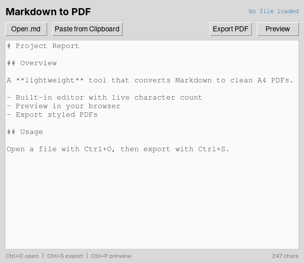

<h1 align="center">MD to PDF</h1>

<p align="center">
  <strong>A tiny desktop Markdown editor that previews in your browser and exports clean A4 PDFs.</strong>
</p>

<p align="center">
  
</p>

---

## What is MD to PDF?

MD to PDF is a single-file Python desktop app for turning Markdown into a polished PDF. Write or paste Markdown into the built-in editor, hit Preview to see it rendered in your browser, and export a styled A4 document with one click — no LaTeX, no Pandoc, no browser print dialogs.

## Features

- **Built-in editor** — Write or edit Markdown directly in the app, with undo and a live character counter
- **Open `.md` files** — Load any `.md`, `.markdown`, or `.txt` file from disk
- **Paste from clipboard** — One-click paste of Markdown content
- **Browser preview** — Renders full Markdown (tables, fenced code, syntax highlighting, TOC) as styled HTML in your default browser
- **PDF export** — A4 output with colored headings, section rules, bullet lists, bold text, and page numbers in the footer
- **Keyboard shortcuts** — `Ctrl+O` open, `Ctrl+S` export, `Ctrl+P` preview

## Requirements

| Dependency  | Install                                              |
|-------------|------------------------------------------------------|
| Python 3.6+ | [python.org](https://python.org)                     |
| tkinter     | Included (Linux: `sudo apt install python3-tk`)      |
| markdown    | `pip install -r requirements.txt`                    |
| fpdf2       | `pip install -r requirements.txt`                    |

## Getting Started

```bash
# Clone the repo
git clone https://github.com/evol1228/md2pdf.git
cd md2pdf

# Install dependencies
pip install -r requirements.txt

# Run it
python md2pdf.py
```

Type Markdown, open a file, or paste from your clipboard — then click **Preview** to check it in the browser, or **Export PDF** to save.

## How the PDF looks

The exporter maps Markdown to a consistent A4 style:

| Markdown        | PDF output                                  |
|-----------------|---------------------------------------------|
| `# Heading`     | Large blue heading with an underline rule   |
| `## Heading`    | Bold heading with a light divider           |
| `- bullet`      | Indented bullet line                        |
| `**bold**`      | Bold inline text                            |
| `---`           | Horizontal rule                             |

Unicode punctuation (em-dashes, smart quotes, ellipses) is automatically converted to PDF-safe equivalents.

## Building a standalone executable

Optional — compile to a single binary with Nuitka:

```bash
pip install nuitka
python -m nuitka --standalone --onefile --windows-disable-console md2pdf.py
```

## License

[MIT](LICENSE) — Use it, modify it, ship it. No strings attached.

---

<p align="center">
  Built by <a href="https://github.com/evol1228">@evol1228</a>
</p>
